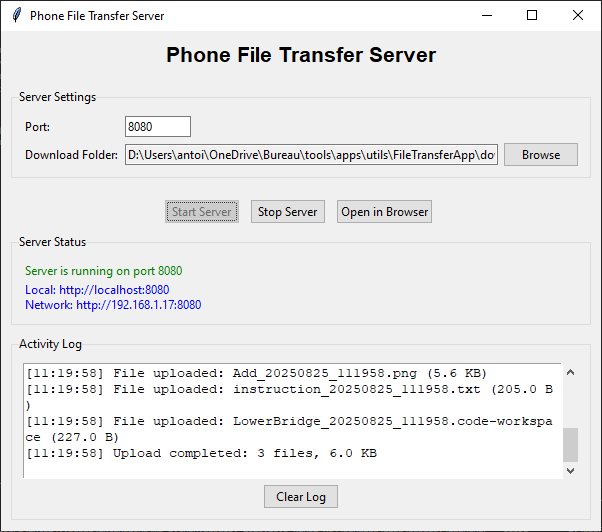
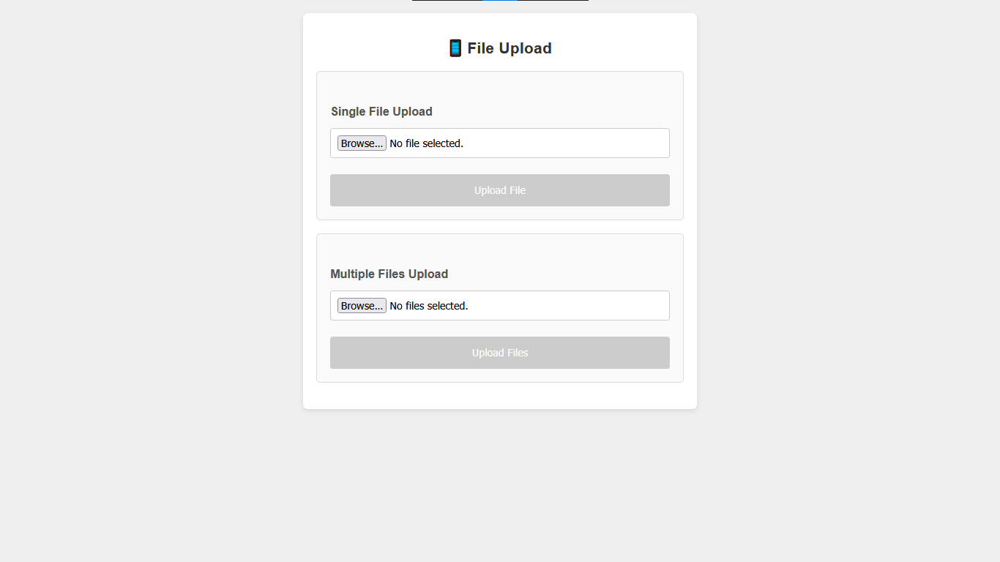
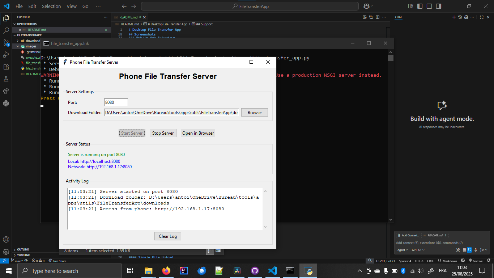
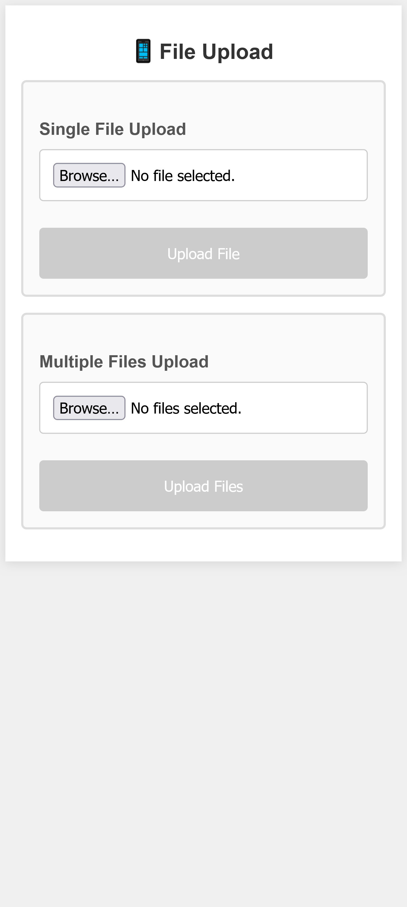
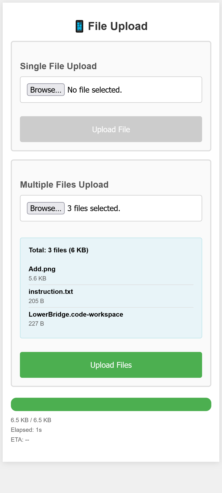
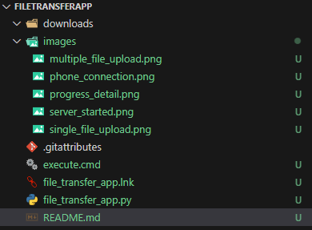

# File Transfer App

A desktop application that creates a local web server for transferring files wirelessly between your phone and computer in both directions.


## Features

- **Bidirectional Transfer**: Send files from phone to computer AND from computer to phone
- **Desktop GUI**: Clean tkinter interface for easy server management
- **Local Web Server**: Flask-based server accessible from any device on your network
- **Mobile-Optimized**: Responsive web interface designed for all phone sizes
- **Real-time Progress**: Upload progress bars with percentage, file size, and time estimates
- **Multiple Upload Modes**: Single file or multiple file uploads
- **File Sharing**: Add files from your computer to share with your phone
- **Auto File Management**: Automatic folder creation and file organization
- **Network Discovery**: Automatically detects and displays your network IP address
- **No Redirects**: AJAX-based uploads keep you on the same page

## Screenshots

### Desktop Application


### Mobile Web Interface


## Installation

### Option 1: Download Executable (Recommended)
1. Go to the [Releases](../../releases) page
2. Download the appropriate version for your system:
   - **Windows**: `FileTransferApp-Windows.exe`
   - **Linux**: `FileTransferApp-Linux`
   - **macOS**: `FileTransferApp-macOS`
3. Run the executable (no installation required!)

### Option 2: Run from Source
**Prerequisites:**
- Python 3.6 or higher
- Flask library

**Setup:**
```bash
# Install Flask
pip install flask

# Run the application
python file_transfer_app.py
```

## Usage

### Starting the Server
1. Launch the desktop application
2. Click **"▶️ Start Server"** in the desktop interface
3. The app will display two URLs:
   - **Local**: `http://localhost:8080` (works only on your computer)
   - **Network**: `http://192.168.x.x:8080` (use this on your phone)



### Connecting from Your Phone
1. Ensure your phone is connected to the same WiFi network as your computer
2. Open your phone's web browser
3. Navigate to the **Network URL** shown in the desktop app
4. You should see the file transfer interface with two sections



## File Transfer Modes

### 📤 Send to Computer (Phone → Computer)
Upload files from your phone to your computer.

**Steps:**
1. On your phone, scroll to the **"📤 Send to Computer"** section
2. Choose **Single File** or **Multiple Files** mode
3. Select your files
4. Tap **"Upload File(s)"**
5. Files are saved to the `downloads/` folder on your computer


### 📥 Get from Computer (Computer → Phone)
Download files from your computer to your phone.

**Steps:**
1. On your computer, click **"📤 Add Files to Share"**
2. Select files you want to share with your phone
3. On your phone, scroll to the **"📥 Get from Computer"** section
4. Tap **"🔄 Refresh File List"** to see available files
5. Tap **"⬇️ Download"** next to any file you want


### Upload Progress
During upload, you'll see:
- Visual progress bar with percentage
- Data transferred (e.g., "2.1 MB / 5.3 MB")
- Elapsed time
- Estimated time remaining



## File Management

### Folder Structure
The app creates two folders in the same directory as the application:

```
your_project_folder/
├── file_transfer_app.py (or .exe)
├── downloads/              # Files received FROM your phone
│   ├── photo1.jpg
│   ├── document.pdf
│   └── video.mp4
└── uploads/                # Files you share TO your phone
    ├── presentation.pptx
    ├── music.mp3
    └── ebook.pdf
```

### File Organization
- **downloads/**: Automatically receives files uploaded from your phone
- **uploads/**: Contains files you've selected to share with your phone
- Files maintain their original names
- If a file with the same name exists, it will be overwritten
- All transfers appear in the desktop app's activity log



## Troubleshooting

### Phone Can't Connect
1. **Check Network**: Ensure both devices are on the same WiFi network
2. **Use Correct IP**: Use the Network URL (192.168.x.x), not localhost
3. **Firewall**: Allow Python/the app through your computer's firewall
4. **Router Settings**: Some routers block device-to-device communication

### Files Not Showing in "Get from Computer"
1. Click **"Add Files to Share"** on the desktop app first
2. Tap **"🔄 Refresh File List"** on your phone
3. Make sure files were successfully copied to the `uploads/` folder

### Slow Performance on Old Phones
The interface is optimized for older devices:
- Minimal JavaScript and CSS
- Large touch targets
- Simple HTML forms
- Sequential file uploads
- Responsive design that adapts to screen size

### Common Issues
| Issue | Solution |
|-------|----------|
| "Connection refused" | Check if server is running and firewall allows connections |
| "Page not loading" | Verify you're using the Network IP, not localhost |
| "Upload fails" | Try smaller files first, check available disk space |
| "No files in download section" | Add files using "Add Files to Share" button on desktop |
| "Can't see uploaded files" | Check the downloads folder in the same directory as the app |

## Technical Details

### System Requirements
- **Desktop**: Windows 7+, macOS 10.12+, or Linux with Python 3.6+
- **Mobile**: Any device with a web browser
- **Network**: WiFi network connecting both devices

### Port Configuration
- Default port: 8080
- Customizable in the source code if needed
- Automatically finds available network interfaces

### Supported File Types
- All file types supported
- No file size restrictions (limited by available disk space and network speed)
- Multiple files can be uploaded simultaneously

## Security Notes

- **Local Network Only**: The server only accepts connections from your local network
- **No Authentication**: Anyone on your network can access the interface
- **No Encryption**: Files are transferred over HTTP (not HTTPS)
- **Temporary Server**: Server stops when you close the desktop application
- **Privacy**: All transfers stay on your local network - nothing goes to the internet

## Building from Source

### Windows
```batch
build.bat
```
Creates `release/FileTransferApp-Windows.exe`

### Linux/Mac
```bash
chmod +x build.sh
./build.sh
```
Creates `release/FileTransferApp-Linux` or `FileTransferApp-macOS`

### Requirements for Building
- Python 3.6+
- PyInstaller (automatically installed by build scripts)
- Flask

## Development

### Code Structure
```
file_transfer_app.py
├── Flask Web Server
│   ├── /upload (receive files from phone)
│   ├── /list_files (list files to share)
│   └── /download/<filename> (send files to phone)
├── Desktop GUI (tkinter)
│   ├── Server controls
│   ├── File sharing interface
│   └── Activity log
└── File Management
    ├── downloads/ folder handling
    └── uploads/ folder handling
```

### Customization
You can modify:
- Upload/download directory paths
- Server port number
- Web interface styling
- File handling behavior
- Maximum file sizes

## License

This project is open source. Feel free to modify and distribute as needed.

## Contributing

Found a bug or want to add a feature? Contributions are welcome:
1. Fork the project
2. Create a feature branch
3. Make your changes
4. Submit a pull request

## Support

For issues or questions:
- Check the troubleshooting section above
- Review the error messages in the desktop application
- Ensure all prerequisites are installed correctly
- Check that both devices are on the same WiFi network

---

**Enjoy seamless bidirectional file transfers between your devices!** 📱↔️💻