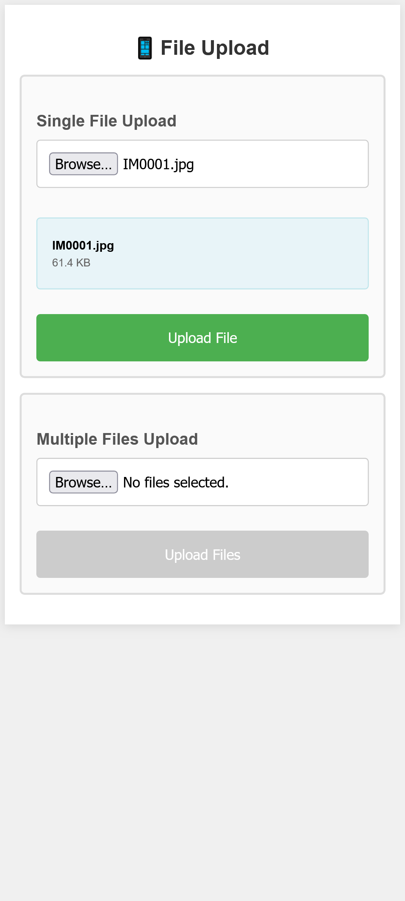
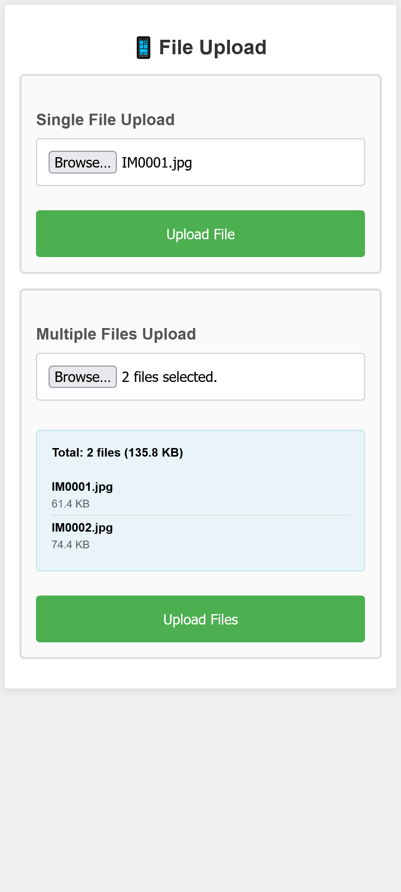

# Desktop File Transfer App

A simple desktop application that creates a local web server for transferring files from your phone to your computer wirelessly.


## Features

- **Desktop GUI**: Clean tkinter interface for easy server management
- **Local Web Server**: Flask-based server accessible from any device on your network
- **Mobile-Optimized**: Responsive web interface designed for phone browsers
- **Real-time Progress**: Upload progress bars with percentage, file size, and time estimates
- **Multiple Upload Modes**: Single file or multiple file uploads
- **Auto File Management**: Automatic folder creation and file organization
- **Network Discovery**: Automatically detects and displays your network IP address
- **No Redirects**: AJAX-based uploads keep you on the same page

## Screenshots

### Desktop Application


### Mobile Web Interface


<!-- 
### Upload Progress

-->

## Installation

### Prerequisites
- Python 3.6 or higher
- Flask library

### Setup
1. Install the required dependency:
```bash
pip install flask
```

2. Download the `file_transfer_app.py` file to your desired directory

3. Run the application:
```bash
python file_transfer_app.py
```

## Usage

### Starting the Server
1. Launch the desktop application by running the Python script
2. Click **"Start Server"** in the desktop interface
3. The app will display two URLs:
   - **Local**: `http://localhost:8080` (works only on your computer)
   - **Network**: `http://192.168.x.x:8080` (use this on your phone)


### Connecting from Your Phone
1. Ensure your phone is connected to the same WiFi network as your computer
2. Open your phone's web browser
3. Navigate to the **Network URL** shown in the desktop app
4. You should see the file upload interface


### Uploading Files
The web interface offers two upload modes:

#### Single File Upload
- Select one file at a time
- Best for larger files or older phones
- Shows file name and size before upload



#### Multiple File Upload
- Select multiple files simultaneously
- Shows first 3 files and total count
- Displays combined file size



### Upload Progress
During upload, you'll see:
- Visual progress bar with percentage
- Data transferred (e.g., "2.1 MB / 5.3 MB")
- Elapsed time
- Estimated time remaining


## File Management

### Default Directory
Files are automatically saved to a `downloads` folder in the same directory as the Python script:
```
your_project_folder/
├── file_transfer_app.py
└── downloads/
    ├── photo1.jpg
    ├── document.pdf
    └── video.mp4
```

### File Organization
- Files maintain their original names
- If a file with the same name exists, it will be overwritten
- All uploaded files appear in the desktop app's activity log


## Troubleshooting

### Phone Can't Connect
1. **Check Network**: Ensure both devices are on the same WiFi network
2. **Use Correct IP**: Use the Network URL, not the localhost URL
3. **Firewall**: Allow Python through your computer's firewall
4. **Router Settings**: Some routers block device-to-device communication

### Slow Performance on Old Phones
The interface is optimized for older devices:
- Minimal JavaScript and CSS
- Large touch targets
- Simple HTML forms
- Sequential file uploads

### Common Issues
| Issue | Solution |
|-------|----------|
| "Connection refused" | Check if server is running and firewall allows connections |
| "Page not loading" | Verify you're using the Network IP, not localhost |
| "Upload fails" | Try smaller files first, check available disk space |
| "Can't see files" | Check the downloads folder in the same directory as the script |

<!--  -->

## Technical Details

### System Requirements
- **Desktop**: Windows, macOS, or Linux with Python 3.6+
- **Mobile**: Any device with a web browser
- **Network**: WiFi network connecting both devices

### Port Configuration
- Default port: 8080
- Customizable in the source code if needed
- Automatically finds available network interfaces

### Supported File Types
- All file types supported
- No file size restrictions (limited by available disk space and network speed)
- Multiple files can be uploaded simultaneously

## Security Notes

- **Local Network Only**: The server only accepts connections from your local network
- **No Authentication**: Anyone on your network can access the upload interface
- **No Encryption**: Files are transferred over HTTP (not HTTPS)
- **Temporary Server**: Server stops when you close the desktop application

## Development

### Code Structure
```
file_transfer_app.py
├── GUI (tkinter)
├── Web Server (Flask)
├── File Handling
└── Network Discovery
```

### Customization
You can modify:
- Upload directory path
- Server port number
- Web interface styling
- File handling behavior

## License

This project is open source. Feel free to modify and distribute as needed.

## Contributing

Found a bug or want to add a feature? Contributions are welcome:
1. Fork the project
2. Create a feature branch
3. Make your changes
4. Submit a pull request

## Support

For issues or questions:
- Check the troubleshooting section above
- Review the error messages in the desktop application
- Ensure all prerequisites are installed correctly

---

**Enjoy seamless file transfers from your phone to your computer!** 📱➡️💻